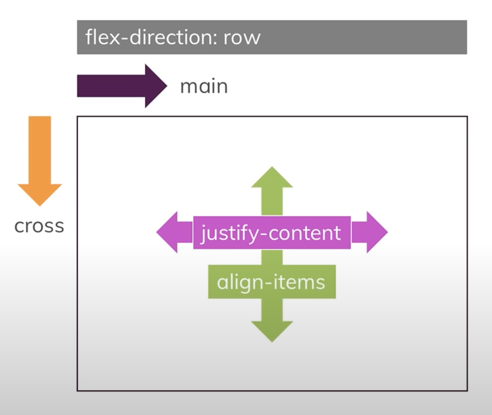

flex
===


``` js
import React from 'react';
import { SafeAreaView, StyleSheet, Text, View } from 'react-native';

export default function EventScreen() {
  return (
    <SafeAreaView style={styles.viewbody}>
      <View style={styles.viewparent}>
        <Text style={styles.view1}>view1</Text>
        <Text style={styles.view2}>w = 150</Text>
        <Text style={styles.view3}>h = 150</Text>
      </View>
    </SafeAreaView>
  );
}
const styles = StyleSheet.create({
  /*flexbox*/
  viewparent: {
    //flex: 1,
    flexDirection: 'row',
    justifyContent: 'space-around', //space the items on this main axis
    alignItems: 'center', // space the items along the cross axis
    paddingTop: 40,
    backgroundColor: '#ddd',
  },

  view1: { flex: 5, backgroundColor: '#f800db', margin: 5 },

  view2: { flex: 1, backgroundColor: '#f800db', margin: 5, width: 150, fontSize: 30 },

  view3: { flex: 1, backgroundColor: '#f800db', margin: 5, height: 150 },
});
```

`flex: 1` - it take all the available space.




ref: https://www.youtube.com/watch?v=siKKg8Y_tQY

convert from html js to React
``` js
import React from 'react';
import { SafeAreaView, StyleSheet, Text, View } from 'react-native';

export default function EventScreen() {
  return (
    <SafeAreaView style={styles.viewbody}>
      <View style={styles.viewparent}>
        <Text style={styles.view1}>view1</Text>
        <Text style={styles.view2}>w = 150</Text>
        <Text style={styles.view3}>h = 150</Text>
        <Text style={styles.view4}>w/h = 150</Text>
        <Text style={styles.view5}>w = 200</Text>
        <Text style={styles.view6}>w = 200</Text>
      </View>
    </SafeAreaView>
  );
}

const styles = StyleSheet.create({
  viewhtml: {
    backgroundColor: '#fa923f',
    padding: 10,
  },

  viewbody: {
    backgroundColor: 'yellow',
    padding: 10,
    margin: 0,
  },

  /*flexbox*/
  viewparent: {
    backgroundColor: '#f073e1',
    margin: 10,
    padding: 30,
    height: 500,
    display: 'flex',            // none, flex. default flex
    flexDirection: 'row',       // column, column-reverse, row, row-reverse. default column
    flexWrap: 'wrap',           // nowrap, wrap, wrap-reverse. default nowrap
    alignItems: 'center',       // baseline, center, flex-end, flex-start, stretch. default stretch
    justifyContent: 'center',   // center, flex-end, flex-start, , space-around, space-between, space-evenly. default flex-start
    alignContent: 'flex-start', // center, flex-end, flex-start, , space-around, space-between, stretch. default flex-start
  },

  view1: {
    backgroundColor: '#f800db',
    margin: 5,
  },

  view2: {
    backgroundColor: '#f800db',
    margin: 5,
    width: 150,
    fontSize: 30,
  },

  view3: {
    backgroundColor: '#f800db',
    margin: 5,
    height: 150,
  },

  view4: {
    backgroundColor: '#f800db',
    margin: 5,
    width: 150,
    height: 150,
  },

  view5: {
    backgroundColor: '#f800db',
    margin: 5,
    width: 200,
  },

  view6: {
    backgroundColor: '#f800db',
    margin: 5,
    width: 200,
  },
});

```

---

last try
``` js
// import { Text, View } from '@components';
import { SafeAreaView, Image, TouchableOpacity, Text, View } from 'react-native';
```


issues - the second box extended over to the other side.
``` js
import React from 'react';
import { useStyleSheet, StyleService } from '@ui-kitten/components';
import { Color } from '@constants';
import { Text, View } from '@components';

export default function EventScreen({ tdata }) {
  const styles = useStyleSheet(themedStyles);

  return (
    <View style={{ marginTop: 300 }}>
      <View style={styles.container}>
        <View style={styles.itemContent}>
          <View style={styles.articleLeft}>
            <View>
              <Text>
                tdata.description tdata.description tdata.description tdata.description
                tdata.description tdata.description tdata.description tdata.description
                tdata.description tdata.description
              </Text>
            </View>
          </View>

          <View>
            <Text>tdata.featureImage tdata.featureImage </Text>
          </View>
        </View>
      </View>
    </View>
  );
}

const themedStyles = StyleService.create({
  container: {
    padding: 25,
    borderBottomWidth: 1,
    borderColor: Color.stroke,
  },
  itemContent: {
    flexDirection: 'row',
    justifyContent: 'space-between',

    height: 112,
    borderColor: 'red',
    borderWidth: 1,
  },
  articleLeft: {
    marginRight: 20,
    // flexDirection: 'column', /// may not neceessary
    borderColor: 'green',
    borderWidth: 1,
  },
});
```
View.js
``` js
/***
 * Custome View base on Ui Kitten
 * @property {string} level
 * - Can be [1,2,3,4]
 *
 * Usage
 * import { View } from '@components' ;
 *
 */

import React from 'react';
import { Layout } from '@ui-kitten/components';

export default function View(props) {
  return <Layout {...props} />;
}
```

---


https://reactnative.dev/docs/layout-props - example shows how different properties can affect or shape a React Native layout. You can try for example to add or remove squares from the UI while changing the values of the property

``` js
import React, { useState } from 'react';
import { Button, ScrollView, StatusBar, StyleSheet, Text, View } from 'react-native';

const App = () => {
  const flexDirections = ['row', 'row-reverse', 'column', 'column-reverse'];
  const justifyContents = [
    'flex-start',
    'flex-end',
    'center',
    'space-between',
    'space-around',
    'space-evenly',
  ];
  const alignItemsArr = [
    'flex-start',
    'flex-end',
    'center',
    'stretch',
    'baseline',
  ];
  const wraps = ['nowrap', 'wrap', 'wrap-reverse'];
  const directions = ['inherit', 'ltr', 'rtl'];
  const [flexDirection, setFlexDirection] = useState(0);
  const [justifyContent, setJustifyContent] = useState(0);
  const [alignItems, setAlignItems] = useState(0);
  const [direction, setDirection] = useState(0);
  const [wrap, setWrap] = useState(0);

  const hookedStyles = {
    flexDirection: flexDirections[flexDirection],
    justifyContent: justifyContents[justifyContent],
    alignItems: alignItemsArr[alignItems],
    direction: directions[direction],
    flexWrap: wraps[wrap],
  };

  const changeSetting = (value, options, setterFunction) => {
    if (value == options.length - 1) {
      setterFunction(0);
      return;
    }
    setterFunction(value + 1);
  };
  const [squares, setSquares] = useState([<Square />, <Square />, <Square />]);
  return (
    <>
      <View style={{ paddingTop: StatusBar.currentHeight }} />
      <View style={[styles.container, styles.playingSpace, hookedStyles]}>
        {squares.map(elem => elem)}
      </View>
      <ScrollView style={[styles.container]}>
        <View style={[styles.controlSpace]}>
          <View style={styles.buttonView}>
            <Button
              title="Change Flex Direction"
              onPress={() =>
                changeSetting(flexDirection, flexDirections, setFlexDirection)
              }
            />
            <Text style={styles.text}>{flexDirections[flexDirection]}</Text>
          </View>
          <View style={styles.buttonView}>
            <Button
              title="Change Justify Content"
              onPress={() =>
                changeSetting(
                  justifyContent,
                  justifyContents,
                  setJustifyContent
                )
              }
            />
            <Text style={styles.text}>{justifyContents[justifyContent]}</Text>
          </View>
          <View style={styles.buttonView}>
            <Button
              title="Change Align Items"
              onPress={() =>
                changeSetting(alignItems, alignItemsArr, setAlignItems)
              }
            />
            <Text style={styles.text}>{alignItemsArr[alignItems]}</Text>
          </View>
          <View style={styles.buttonView}>
            <Button
              title="Change Direction"
              onPress={() => changeSetting(direction, directions, setDirection)}
            />
            <Text style={styles.text}>{directions[direction]}</Text>
          </View>
          <View style={styles.buttonView}>
            <Button
              title="Change Flex Wrap"
              onPress={() => changeSetting(wrap, wraps, setWrap)}
            />
            <Text style={styles.text}>{wraps[wrap]}</Text>
          </View>
          <View style={styles.buttonView}>
            <Button
              title="Add Square"
              onPress={() => setSquares([...squares, <Square/>])}
            />
          </View>
          <View style={styles.buttonView}>
            <Button
              title="Delete Square"
              onPress={() =>
                setSquares(squares.filter((v, i) => i != squares.length - 1))
              }
            />
          </View>
        </View>
      </ScrollView>
    </>
  );
};

const styles = StyleSheet.create({
  container: {
    height: '50%',
  },
  playingSpace: {
    backgroundColor: 'white',
    borderColor: 'blue',
    borderWidth: 3,
  },
  controlSpace: {
    flexDirection: 'row',
    flexWrap: 'wrap',
    backgroundColor: '#F5F5F5',
  },
  buttonView: {
    width: '50%',
    padding: 10,
  },
  text: { textAlign: 'center' },
});

const Square = () => (
  <View style={{
    width: 50,
    height: 50,
    backgroundColor: randomHexColor(),
  }} />
);

const randomHexColor = () => {
  return '#000000'.replace(/0/g, () => {
    return (~~(Math.random() * 16)).toString(16);
  });
};

export default App;
```


---
### flexGlow
https://reactnative.dev/docs/flexbox#flex-basis-grow-and-shrink
