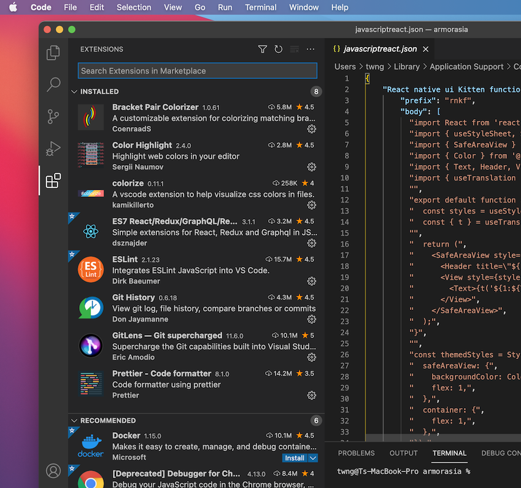
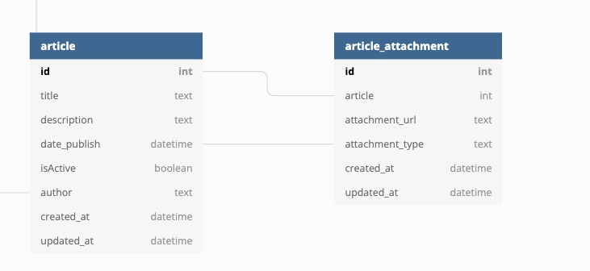
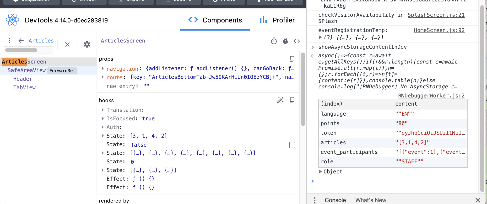

## Setting up

#### The following shown WhatsApp correspondence of setting up the MacBook Pro

``` yaml
[9:19 AM, 7/12/2021] Jing Wei Findjobs: Xcode
[9:19 AM, 7/12/2021] Jing Wei Findjobs: Vscode
[9:19 AM, 7/12/2021] Jing Wei Findjobs: Android studio
[10:26 AM, 7/12/2021] Jing Wei Findjobs: hook
[10:26 AM, 7/12/2021] Jing Wei Findjobs: graphql
[10:31 AM, 7/12/2021] Jing Wei Findjobs: https://www.youtube.com/watch?v=qSRrxpdMpVc&ab_channel=Academind
[10:32 AM, 7/12/2021] Jing Wei Findjobs: https://www.youtube.com/watch?v=W6NZfCO5SIk&ab_channel=ProgrammingwithMosh
[10:36 AM, 7/12/2021] Jing Wei Findjobs: https://www.adobe.com/sg/products/xd/switcher.html
[1:50 PM, 7/12/2021] Jing Wei Findjobs: usecontext
[1:57 PM, 7/12/2021] Jing Wei Findjobs: https://www.google.com/search?q=spread+operator&rlz=1C5CHFA_enSG961&oq=spread+operator&aqs=chrome..69i57j0l9.3759j0j7&sourceid=chrome&ie=UTF-8
[2:00 PM, 7/12/2021] Jing Wei Findjobs: maintabnavigator.js
[2:00 PM, 7/12/2021] Jing Wei Findjobs: react-navigation V4
[2:05 PM, 7/12/2021] Jing Wei Findjobs: hasura graphql
```

setup vscode to run application with simulator
* % git clone <copy from gitlab>
* % cd amorasia
* % code
* % npm install
* % cd ios
* % pop install       (cocopod install)    
* % cd ..      ( using finder/explorer, double click the app, armorasia.xcworkspan to open?? )

### rnkf
call template applcation
* vsCode > code > preference > User Snippets > 
* > javascriptreact.json    
    
javascriptreact.json   
``` yaml
"React native ui Kitten functional SafeAreaView": {
    "prefix": "rnkf",
    "body": [
      "import React from 'react';",
      "import { SafeAreaView , View, StyleSheet } from 'react-native';",
      "import { Color } from '@constants';",
      "import { Text, Header } from '@components';",
      "import { useTranslation } from 'react-i18next';",
      "",
      "export default function ${TM_FILENAME_BASE}() {",
      "  const { t } = useTranslation();",
      "",
      "  return (",
      "    <SafeAreaView style={styles.safeAreaView}>",
      "      <Header title=\"${1:${TM_FILENAME_BASE}}\" />",
      "      <View style={styles.container}>",
      "        <Text>{t('${1:${TM_FILENAME_BASE}}')}</Text>",
      "      </View>",
      "    </SafeAreaView>",
      "  );",
      "}",
      "",
      "const styles = StyleSheet.create({",
      "  safeAreaView: {",
      "    backgroundColor: Color.bgDefault,",
      "    flex: 1,",
      "  },",
      "  container: {",
      "    flex: 1,",
      "  },",
      "});"
    ],
    "description": "Ui Kitten functional component with SafeAreaView and translation"
  },
```

``` yaml
[4:18 PM, 7/21/2021] Alvin NG 😀 .: https://react.i18next.com/
[4:30 PM, 7/21/2021] Alvin NG 😀 .: 
        1. React navigation V6 ---> app navigation
        2. Ui Kitten ---> ui library
        3. react-il8next --> transaltion

        --- react ---
        1.  hook ---> useState, useEffect, useContext , useRef


        --- javascript ---
        1. spread , rest operation (...)
        2. array destructure
        3. object destructure
        4. Optional chaining (?.)
        5. tertionary Operation ? :
        6. ||. &&
        7. Array method
        8. Object method
[4:30 PM, 7/21/2021] Alvin NG 😀 .: not use view, text from react native
[4:31 PM, 7/21/2021] Alvin NG 😀 .: not use header, button , text from ui kitten
[4:34 PM, 7/21/2021] Alvin NG 😀 .: instead import from '@components
[4:36 PM, 7/21/2021] Alvin NG 😀 .: View also from Here
```
``` yaml
Evan Icons - https://akveo.github.io/eva-icons/#/    
[10:02 am, 04/08/2021] Jing Wei Findjobs: https://dbdiagram.io/d/610766112ecb310fc3b90204
[10:03 am, 04/08/2021] Jing Wei Findjobs: optional chaining
```

    
#### Code extension
    
- Bracket Pair Colorizer
- Color Highlight
- colorize 
- ES7 React/Redux/GraphQL/React-Native snippets
- ESLint
- Git History
- GitLens - Git supercharged
- Prettier - Code formatter


#### Software running on comp:
* VSCode
* CreativeCloud
* Xcode
* Simulator (Xcode)
* Terminal (running Metro)
* Chrome
* Adobe XD (running the wireFrame UI/UX )

#### Chrome browser tabs after two weeks
* Setting up the development environment : https://reactnative.dev/docs/next/environment-setup
* React Navigation : https://reactnavigation.org/docs/6.x/getting-started
* CocoaPods : https://guides.cocoapods.org/using/getting-started.html
* react-i18next : https://react.i18next.com/
* Xd Adobe XD : https://xd.adobe.com/landing/cloud-documents/en/desktop_no_xd.html
* GitLab : https://gitlab.com/
* Jira Software : https://yefj.atlassian.net/jira/projects?selectedProjectType=software
* Destructuring assignment : https://developer.mozilla.org/en-US/docs/Web/JavaScript/Reference/Operators/Destructuring_assignment

* UI Kitten : https://akveo.github.io/react-native-ui-kitten/docs/components/icon/overview#icon
* Eva Icons : https://akveo.github.io/eva-icons/#/?searchKey=bookmark&type=outline
* Modal React Native : https://reactnative.dev/docs/modal#hardwareaccelerated-android
* Material Top Tabs Navigator : https://reactnavigation.org/docs/6.x/material-top-tab-navigator
* paySlip - https://essentials.singtelmybusiness.com/#!/dashboard

#### database

* DBDiagram.io  - https://dbdiagram.io/d/610766112ecb310fc3b90204

#### ref
- https://akveo.github.io/eva-icons/#/
    
    
---
### restarting for build failed

* start xcode    
    
* terminal > npm install > cd ios > pod install > cd ..
``` console
twng@Ts-MacBook-Pro armorasia % npm install

up to date, audited 1259 packages in 2s

78 packages are looking for funding
  run `npm fund` for details

7 moderate severity vulnerabilities

To address all issues (including breaking changes), run:
  npm audit fix --force

Run `npm audit` for details.
twng@Ts-MacBook-Pro armorasia % cd ios
twng@Ts-MacBook-Pro ios % pod install
Auto-linking React Native modules for target `armorasiaapp`: RNCAsyncStorage, RNGestureHandler, RNLocalize, RNReanimated, RNSVG, RNScreens, react-native-pager-view, and react-native-safe-area-context
Analyzing dependencies
Downloading dependencies
Generating Pods project
Integrating client project
Pod installation complete! There are 58 dependencies from the Podfile and 49 total pods installed.
twng@Ts-MacBook-Pro ios % cd ..
twng@Ts-MacBook-Pro armorasia %     
```

* xcode > click run icon
        
---
### React Native Debuger
``` console
twng@Ts-MacBook-Pro findjobs_universe % brew upgrade
twng@Ts-MacBook-Pro findjobs_universe % brew install --cask react-native-debugger   
```
- click the `React Native Debugger` app
- DevTools
- run the `XCode` > Control + Command + Z > `Debug with Chrome` > it should show console run on Debugger
- console type `showAsynStorageContentInDev`
- right cick on the inspector screen > select `Log AsyncStorage content` to shown its storage contents
- Search the js to be debug ...
-         
    
---    
