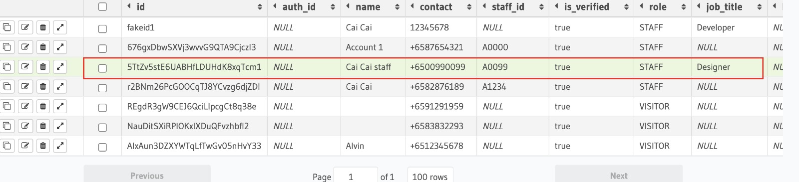
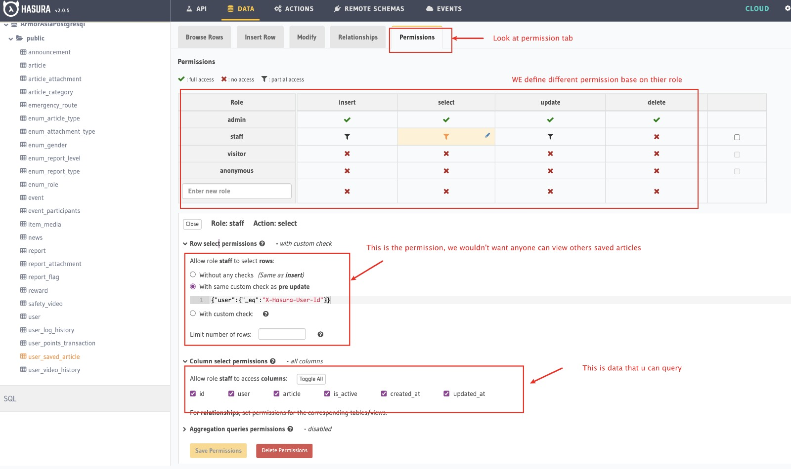

## user_saved_article

#### Relationships
* articleByArticle: user_saved_article -> article.id
* userByUser: user_saved_article -> user_saved_article.user -> user.id

1. copy the token from console output token.
2. paste to Hasura's Authorization > value: Bearer <paste token here>.
3. enter by click the lock icon.

  
  
#### Permissions
user_saved_article can be assess by authorised users.
  
Allow role staff to access columns:
  - id
  - user
  - article
  - is_active
  - created_at
  - updated_at
  
1. copy the user Id from user's data. eg: 5TtZv5stE6UABHfLDUHdK8xqTcm1
2. insert new row to  user_saved_article with user_id and article_id

  
#### API 
``` graphql
query MyQuery {
  user_saved_article {
    id
    articleByArticle {
      id
    }
    userByUser {
      id
    }
    is_active
    updated_at
    created_at
  }
}
```  
``` console
{
  "data": {
    "user_saved_article": [
      {
        "id": 3,
        "articleByArticle": {
          "id": 1
        },
        "userByUser": {
          "id": "5TtZv5stE6UABHfLDUHdK8xqTcm1"
        },
        "is_active": true,
        "updated_at": "2021-09-14T01:30:18.531886+00:00",
        "created_at": "2021-09-14T01:30:18.531886+00:00"
      }
    ]
  }
}
```  
  
---
AuthContext.js  
``` js
import React, { useState, useEffect, useContext } from 'react';
import { Platform } from 'react-native';
import { store } from '../functions';
import { Config } from '@constants';
import jwt from 'jwt-decode';
import AsyncStorage from '@react-native-async-storage/async-storage';
import auth from '@react-native-firebase/auth';
import database from '@react-native-firebase/database';

let AuthContext;
let { Provider } = (AuthContext = React.createContext());

const AuthProvider = ({ children }) => {
  const [token, setToken] = useState(null);
  const [role, setRole] = useState(null);
  const [initializing, setInitializing] = useState(true);
  const [isAuthenticated, setIsAuthenticated] = useState();
  const [userID, setUserID] = useState(null);

  useEffect(() => {
    const subscriber = auth().onAuthStateChanged(onAuthStateChanged);
    return subscriber; // unsubscribe on unmount
  }, []);

  const getToken = async () => {
    const tempToken = await auth().currentUser.getIdToken();
    if (tempToken) {
      store.save('token', tempToken);
      return token;
    } else {
      await logOut();
      return false;
    }
  };

  // Handle user state changes
  async function onAuthStateChanged(user) {
    // console.log('auth change');
    if (initializing) {
      setInitializing(false);
    }
    if (user) {
      try {
        const tempToken = await user.getIdToken();
        const idTokenResult = await user.getIdTokenResult();
        const hasuraClaim = idTokenResult.claims['https://hasura.io/jwt/claims'];
        // console.log('hasuraClaim: ', hasuraClaim);
        if (hasuraClaim) {
          await handleAuthenticated(tempToken, user.uid);
        } else {
          // Check if refresh is required.
          const metadataRef = database().ref('metadata/' + user.uid + '/refreshTime');
          metadataRef.on('value', async (data) => {
            if (!data.exists) {
              return;
            }
            // Force refresh to pick up the latest custom claims changes.
            const tempToken = await user.getIdToken(true);
            await handleAuthenticated(tempToken, user.uid);
          });
        }
      } catch (error) {
        setIsAuthenticated(false);
      }
    } else {
      setIsAuthenticated(false);
    }
  }

  const handleAuthenticated = async (tempToken, userId) => {
    console.log('token: ', tempToken);
    await checkAuthStatus();
    setIsAuthenticated(true);
    setToken(tempToken);
    setUserID(userId);
    store.save('token', tempToken);
  };

  const checkAuthStatus = async () => {
    const tempRole = await store.get('role');
    // console.log('tempRole: ', tempRole);
    if (tempRole) {
      setRole(tempRole);
    }
  };

  const logOut = async () => {
    auth().signOut();
    const asyncStorageKeys = await AsyncStorage.getAllKeys();
    if (asyncStorageKeys.length > 0) {
      if (Platform.OS === 'android') {
        await AsyncStorage.clear();
      }
      if (Platform.OS === 'ios') {
        await AsyncStorage.multiRemove(asyncStorageKeys);
      }
    }
  };

  return (
    <Provider value={{ isAuthenticated, role, token, userID, logOut, getToken }}>
      {children}
    </Provider>
  );
};

const useAuth = () => useContext(AuthContext);

/** HOC */
const AuthConsumer = AuthContext.Consumer;
const withAuth = (Component) => (props) =>
  <AuthConsumer>{(state) => <Component {...props} auth={state} />}</AuthConsumer>;

export { useAuth, AuthContext, AuthProvider, withAuth };
```  
---
  
### navigation for bookmark
  
ArticlesScreen.js
``` js
export default function ArticlesScreen() {
  const [booked, setBooked] = useState(false);
  const [stores, setStores] = useState([]);  
  ...
          <ArticlesList articlesData={articlesData} stored={booked} category={'Environment'} />  
```
ArticlesList.js
``` js
export default function ArticlesList({ articlesData, stored, category }) {
  const dataFilter = articlesData.filter((d) => d.article_type === category);

  const renderItem = ({ item }) => {
    return <ArticleItem tdata={item} stored={stored} />;  
```  
ArticleItem.js
``` js
export default function ArticleItem({ tdata, stored }) {
  const navigation = useNavigation();
  const [booked, setBooked] = useState(stored);
  ...
      {booked ? t('Saved') : t('Save')}  
  ...
        onPress={() => navigation.navigate('ArticleDetailScreen', { item: tdata, stored: booked })}>  
```
ArticleDetailScreen.js
``` js
export default function ArticleDetailScreen({ route, navigation }) {
  const { item, stored } = route.params;

  const [isSaved, setIsSaved] = useState(stored);
  const detailId = item.id;
...
              <Icon {...props} name={isSaved ? 'bookmark' : 'bookmark-outline'} fill={Color.text} />  
```
---  
